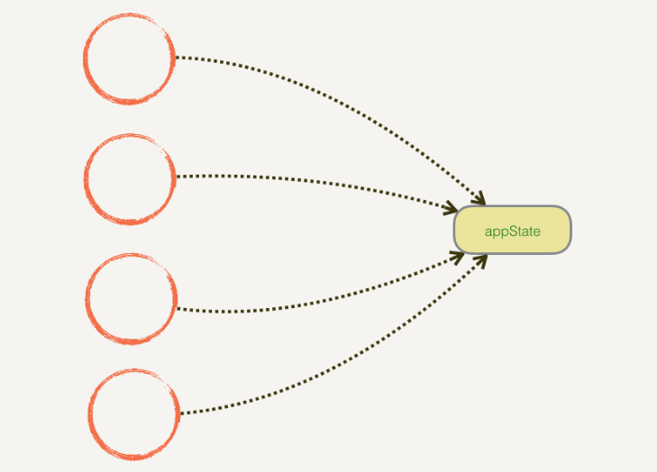
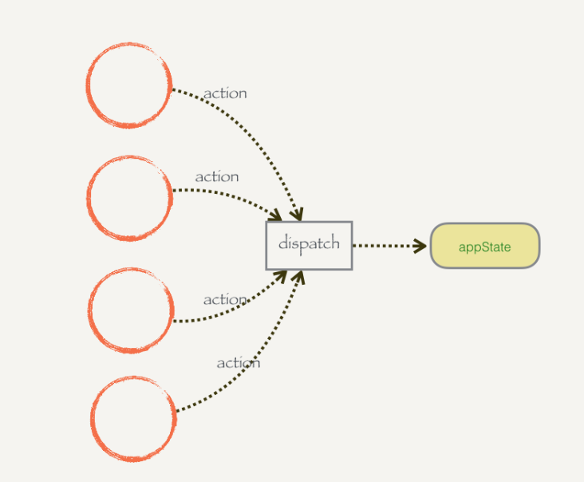
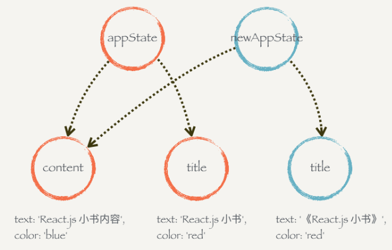

### 动手实现Redux,源代码在index.js中
## 第一步：优雅的修改共享模式  
共享数据的修改模式改变了  
原来的模块修改共享数据是直接改：  
  
改为通过中间人dispatch进行修改  
  

## 第二步：抽离store和监控数据变化  
把state和dispatch集中到一起，构建一个createStore,
抽离出store后换有一个问题，数据发生变化之后，换需要renderApp进行渲染，利用观察者模式监听数据变化。  
实现方法，给createStore添加一个数组存储监听方法，状态更改都是调用监听方法

## 第三步：纯函数Pure Function
什么是纯函数？一个函数的返回结果只依赖它的参数，并且在执行过程里面没有副作用。

## 第四步：共享结构的对象提高性能  
利用ES6的语法特性新建一个appState

## 第五步：不要问为什么的reducer  
合并原来的appState和stateChanger,将createStore函数接收参数改名为reducer，为一个纯函数。

## 第五步：Redux总结
通过前面这几部，完成了Redux模式，先是从简单的例子中发现共享的状态不能被任意修改，会出现问题，所以通过dispatch执行门槛操作，并且要在action中进行声明。  
然后将state和dispatch合并，构建函数createStore.  
然后利用store。subscribe订阅数据修改事件，每次修改自动渲染视图。  
因为重新渲染视图带来性能问题，所以在每个渲染函数开头进行简单判断，避免重新渲染。  
最后优化了stateChanger.  
现在createStore可以直接拿来用了。